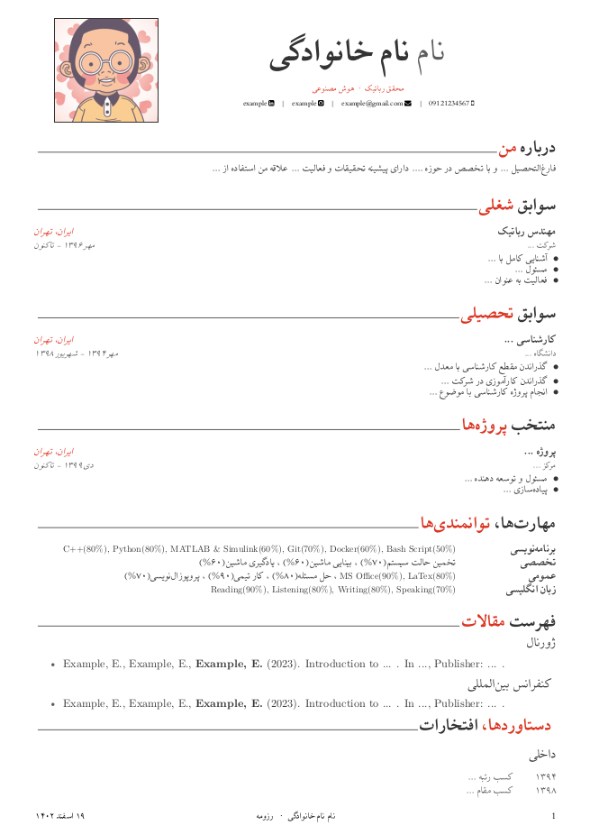

# Persian Resume Template

  

This repository contains the Persian version of the LaTeX resume template "Awesome_CV" originally created by [posquit0](https://github.com/posquit0). The template is designed to create professional resumes using LaTeX.

### Usage
You can use this template on [Overleaf](https://www.overleaf.com/) with the xelatex compiler.

### Credits
- Original "Awesome_CV" template by posquit0: [GitHub Repository](https://github.com/posquit0/Awesome-CV)

---
<h1 dir="rtl">قالب رزومه فارسی</h1>

این مخزن شامل نسخه فارسی از قالب رزومه "Awesome_CV" است که ابتدا توسط <a href="https://github.com/posquit0">posquit0</a> ایجاد شده است. این قالب برای ایجاد رزومه‌های حرفه‌ای با استفاده از LaTeX طراحی شده است.

<h3 dir="rtl">استفاده</h3>

شما می‌توانید از این قالب در <a href="https://www.overleaf.com/">Overleaf</a> با کامپایلر xelatex استفاده کنید.

<h3 dir="rtl">مرجع</h3>
<ul dir="rtl">
    <li>قالب اصلی "Awesome_CV" توسط posquit0: <a href="https://github.com/posquit0/Awesome-CV">مخزن GitHub</a></li>
</ul>